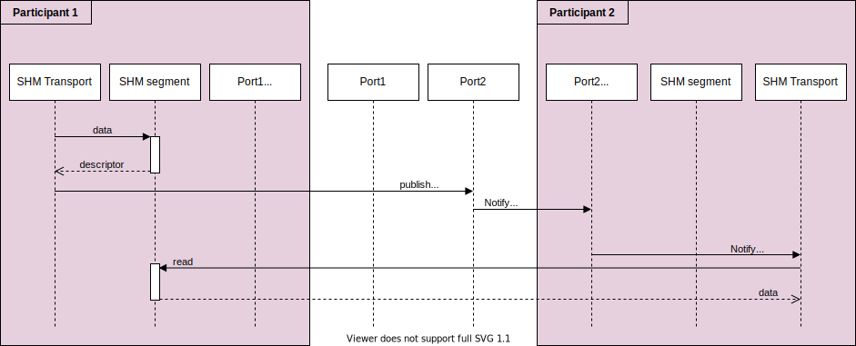

## 基础概念

### 1、共享内存传输通道
共享内存传输时序图

与 eCAL 的共享内存方案采用的方式类似，使用的消息通知机制，当发布者在共享内存缓冲区中写入数据之后，通知接收者缓冲区中有数据。接收者会接收这个通知，然后调用对应的函数到缓冲区中处理数据执行订阅回调之类的。

共享内存缓冲区设计：

- 1、Segment

共享内存块，不同进程可以访问到的共享内存块。每一个设置了共享内存传输的参与者都会创建一个共享内存块。域的参数者将自己需要 publish 的消息写入到自己的共享内存块中，别的域参与者或者说别的节点可以读取到该共享内存块。

每一个共享内存块都有一个唯一的标识，segmentId。这些segmentId 用于识别和访问每个DomainParticipant 的段。

- 2、Segment Buffer

在共享内存段中分配的缓冲区。它充当放置在分段中的 DDS 消息的容器。换句话说，DomainParticipant在Segment上写入的每条消息都将被放置在不同的缓冲区中。

- 3、Segment Descriptor

它充当指向特定Segment中的特定Segment Buffer的指针。它包含段 ID 和段缓冲区相对于段基址的偏移量。与其他域参与者传递消息时，共享内存传输仅分发缓冲区描述符，避免将消息从 DomainParticipant 复制到另一个 DomainParticipant。通过此描述符，接收域参与者可以访问写入缓冲区中的消息，因为它唯一标识了分段（通过分段 ID）和分段缓冲区（通过其偏移量）。

- 4、Port

表示通信缓冲区描述符的通道。它被实现为共享内存中的环形缓冲区，因此任何 DomainParticipant 都可以在其上读取或写入信息每个端口都有一个唯一的标识符，即一个可用于引用端口的 32 位数字。每个配置了共享内存传输的 DomainParticipant 都会创建一个端口来接收缓冲区描述符。

该端口的标识符在发现过程中共享，以便远程对等方在想要与每个 DomainParticipant 通信时知道要使用哪个端口。(TODO: 仅在发现过程中共享还是后续可以继续获取？)

- 5、端口健康检查

每次 DomainParticipant 打开端口（用于读取或写入）时，都会执行健康检查以评估其正确性。原因是，如果涉及的进程之一在使用端口时崩溃，则该端口可能会处于不工作状态。如果附加的侦听器在给定的超时时间内没有响应，则该端口被视为已损坏，并且会被销毁并再次创建。
